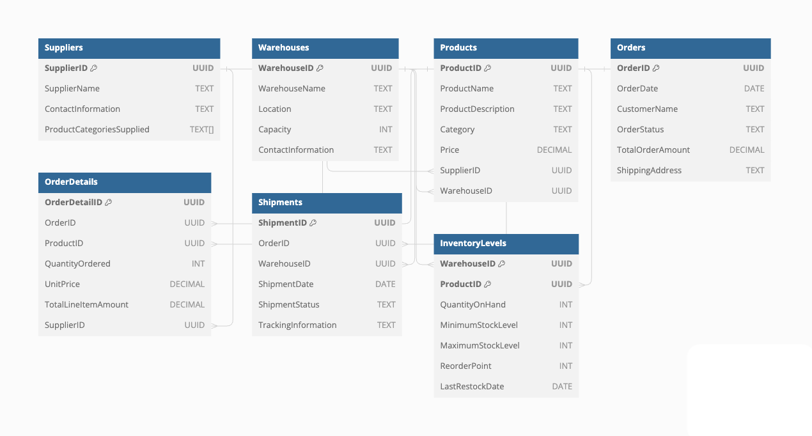

# ISP_Part2

This repository contains a collection of SQL scripts and Python scripts designed for managing a supply chain database. The project illustrates the process of creating and manipulating a database for supply chain management, including tasks such as database creation, schema execution, data insertion, fragmentation, and replication. It's structured to be easily understood and executed, making it ideal for educational purposes or as a base for more complex projects.

## Contents

1. **Python Scripts**: Used for creating the database, connecting to it, executing SQL schema scripts, inserting data, performing database fragmentation, and database replication.

2. **SQL Scripts**: Contains the SQL code for creating tables (`main_schema.sql`) and inserting sample data (`insert_data.sql`). These tables include Products, Warehouses, Suppliers, Orders, OrderDetails, Shipments, and InventoryLevels.

## Setup and Execution

### Prerequisites

- Python 3.x
- PostgreSQL Database Server
- psycopg2 library (Python PostgreSQL adapter)

### Installation Steps

1. **Install psycopg2**: This Python library is essential for connecting to and interacting with PostgreSQL databases. Install it using pip:

   ```bash
   pip install psycopg2
   ```

2. **PostgreSQL Server**: Ensure you have PostgreSQL server installed and running on your system.

### How to Use

1. **Clone the Repository**: Clone this repository to your local machine.

2. **Database Creation**: Run the `create_database()` function from the Python script to create a new database for the supply chain management.

3. **Schema Execution**: Execute the `execute_schema_script()` function to create the necessary tables defined in the `main_schema.sql`.

4. **Data Insertion**: Use the `execute_insert_script()` function to insert sample data into the database from `insert_data.sql`.

5. **Database Fragmentation**: The `perform_fragmentation()` function is used to fragment the database into multiple tables based on specific attributes like product categories and warehouse locations.

6. **Database Replication**: Finally, the `replication()` function can be used to create a backup of the database.

## Database Structure


### Tables

- **Products**: Stores information about the products.
- **Warehouses**: Information about warehouses.
- **Suppliers**: Details of suppliers.
- **Orders**: Customer orders.
- **OrderDetails**: Details of each order.
- **Shipments**: Information about product shipments.
- **InventoryLevels**: Inventory levels in each warehouse.


### Fragmentation

Database fragmentation is a process of dividing a database into smaller, more manageable segments. This technique is particularly beneficial for large databases, where managing and querying a vast amount of data can be challenging. In this project, fragmentation is based on specific criteria such as product categories and warehouse locations, leading to more efficient data management.

### Replication

Database replication involves creating a copy of the database. This copy can serve multiple purposes: it acts as a backup for recovery, aids in load balancing, and allows for running complex queries without impacting the primary database's performance.

## Fragmentation

### Purpose

- **Enhanced Performance**: Improves query performance by reducing the size of the data set being queried.
- **Efficient Management**: Simplifies management by dividing the database into logically related parts.

### Implementation

- **Category-Based Fragmentation**: Products are divided into different tables based on their categories.
- **Location-Based Fragmentation**: Warehouses are segmented into distinct tables based on their locations.

### Usage

Fragmentation is implemented in the Python script where specific SQL queries are used to create new tables based on the predefined criteria (categories and locations).

## Replication

### Purpose

- **Data Redundancy**: Ensures data availability in case of primary database failure.
- **Load Balancing**: Distributes query load across multiple database copies.
- **Analytics and Reporting**: Facilitates complex queries and reporting tasks without affecting the primary database.

### Implementation

- **Timestamped Backup**: The replication process creates a timestamped backup of the database, which is essential for tracking changes and ensuring data integrity.

### Usage

The replication process is scripted in Python, where a new database copy is created using the current database as a template. This process is timestamped to maintain version control.


## Schema and Output Screenshots

### Database Schema


### Python Script


### PostgreSQL Connection


### Schema Execution and Fragmentation


### Fragmentation Tables


### Replication and Backup


### Replicated Database


### Replicated Tables

